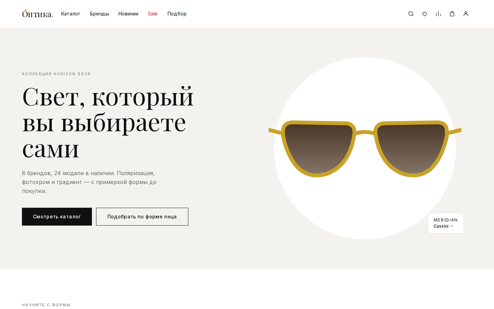
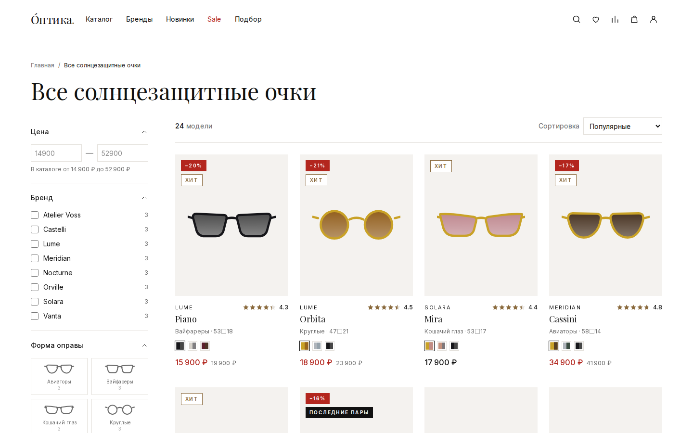
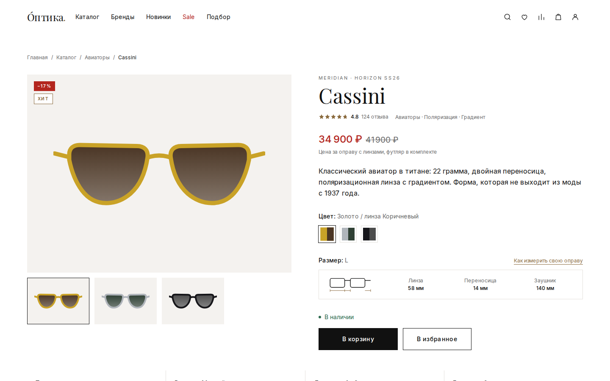
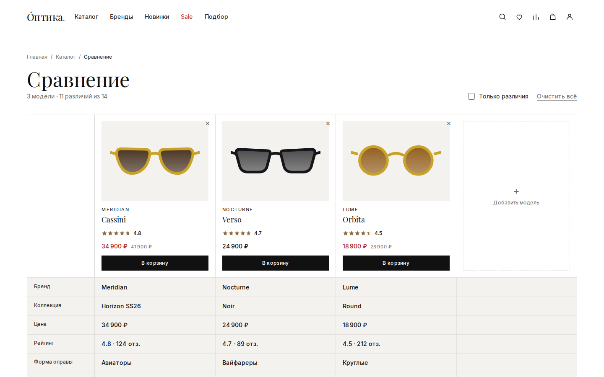

# О́птика — интернет-магазин солнцезащитных очков

Мультибрендовый магазин: каталог с фасетными фильтрами, подбор оправы по форме лица, сравнение моделей и отзывы с фотографиями.

Next.js 16 (App Router) · React 19 · TypeScript · Tailwind CSS v4.

> **Демонстрационный проект.** Бренды, цены и наличие вымышлены, заказ не оформляется. Индексация поисковиками закрыта в [`src/app/robots.ts`](src/app/robots.ts).



## Запуск

```bash
pnpm install
pnpm dev          # http://localhost:3000
```

```bash
pnpm build && pnpm start   # продакшен-сборка
pnpm lint
```

Сборке нужен интернет: [`next/font/google`](src/app/layout.tsx) скачивает Inter и Playfair Display и инлайнит их.

## Что внутри

15 экранов: главная, каталог, карточка товара, поиск, сравнение, подбор по форме лица, список брендов и страница бренда, личный кабинет, избранное, корзина, чекаут, помощь, пустые состояния.

| | |
|---|---|
|  |  |
| Каталог: 11 фасетов со счётчиками, состояние в URL | Карточка: вариации, схема размеров, отзывы |

## Как это устроено

**Весь каталог — один модуль.** [`src/lib/catalog.ts`](src/lib/catalog.ts) держит модель товара, данные, предикаты фильтрации, подсчёт фасетов и текстовый поиск. Подключение реального источника — замена одного массива `PRODUCTS`; сигнатуры `filterProducts`, `facetCount`, `getProduct`, `suggest` при этом не меняются.

**Каталог, поиск и страница бренда — один компонент.** [`CatalogView`](src/components/catalog-view.tsx) отличается только подмножеством товаров и скрытыми фасетами. Текстовый запрос — такой же предикат в `Query`, как и фасеты, поэтому `?q=титан&size=M` работает без отдельного кода.

**Счётчик фасета считается на выдаче без самого этого фасета.** Иначе выбор одного бренда обнулил бы счётчики всех остальных и фильтр стал бы одноразовым.

**Состояние фильтров и список сравнения живут в URL.** Выдача и сравнение шарятся ссылкой, кнопка «назад» возвращает предыдущий набор условий. Отметка в фасете ставится оптимистично — иначе она ждала бы ответа сервера.

**Оправы рисуются параметрически.** [`Glasses`](src/components/glasses.tsx) принимает форму, цвет оправы и цвет линзы из модели товара — один компонент обслуживает карточку, галерею, миниатюры, корзину и пиктограммы фильтра, поэтому свотч цвета и картинка не могут разойтись. При появлении фотосъёмки меняется один файл.



**Корзина, избранное, сравнение, отзывы и результат подбора** — внешние хранилища поверх `localStorage`, все по одному шаблону на `useSyncExternalStore`: переживают навигацию, синхронизируются между вкладками, читаются без эффекта на монтировании. Перенос на сервер меняет реализацию чтения и записи, интерфейс хуков остаётся.

```
src/
├── app/          маршруты
├── components/   UI и клиентские хранилища
└── lib/
    ├── catalog.ts   ★ модель товара, данные, фильтрация, поиск
    ├── orders.ts    демонстрационные заказы и адреса
    └── format.ts    цены, даты, склонения
```

## Проверка

```bash
node scripts/visual-check.mjs   # 17 страниц × 2 брейкпоинта
node scripts/flow-check.mjs     # 27 интерактивных сценариев
```

Первый снимает скриншоты и проверяет горизонтальную прокрутку (с указанием элемента-виновника), ошибки консоли и расхождения гидратации. Второй проходит сценарии: поиск по Ctrl+K, фасет → URL → «назад», сравнение, корзину, валидацию чекаута, квиз, мобильные панели.

Playwright намеренно не в зависимостях — он нужен только для ручной проверки. Установка описана в [`scripts/README.md`](scripts/README.md).

## Деплой

Netlify собирает проект своим OpenNext-адаптером, конфигурация нулевая: импортировать репозиторий в панели, настройки подхватятся из [`netlify.toml`](netlify.toml). Переменные окружения не нужны — приложение самодостаточно.

## Документация

Проект вёлся по регламенту из [`Test/claud.md`](Test/claud.md): интервью → анализ → UX-структура → карта страниц → UI-система → реализация → документация → передача.

| Документ | О чём |
|---|---|
| [00-PROJECT-STATE](Test/docs/00-PROJECT-STATE.md) | Состояние, 28 зафиксированных решений с обоснованиями |
| [02-analysis](Test/docs/02-analysis.md) | Барьеры покупки, модель данных товара, сценарии |
| [03-ux-structure](Test/docs/03-ux-structure.md) | Навигация, фильтры, сравнение, подбор, поиск |
| [05-ui-system](Test/docs/05-ui-system.md) | Токены, компоненты, правила поведения интерфейса |
| [06-design-execution](Test/docs/06-design-execution.md) | Что реализовано и что нашла проверка в браузере |
| [07-handoff](Test/docs/07-handoff.md) | Точки подключения данных, деплой, чек-лист запуска |
| [08-deploy-netlify](Test/docs/08-deploy-netlify.md) | Пошаговая выкладка на Netlify |

## Чего нет

Авторизации, реальной оплаты и доставки, серверного хранения. Не проверялось на реальных устройствах и в Safari, нет замеров производительности и проверки скринридером. Полный список — в разделе 7 [handoff](Test/docs/07-handoff.md).
